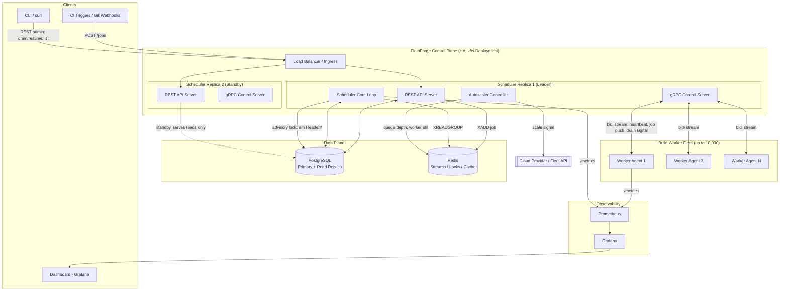

# 1. System Architecture Overview

This document describes the original target production architecture: HA scheduler replicas behind a load balancer on Kubernetes, a Postgres read replica, and cloud-provider autoscaling. It predates implementation and is kept as-is because it's the design this system was built toward. What actually runs in local development today is simpler: see the README's Architecture section for the as-built diagram, and `docs/07-repository-structure.md` section 7.2 for a specific list of what was scoped out (cloud autoscaling, read replicas, Kubernetes manifests, rate limiting).

## 1.1 Tech stack recommendation

There's a wide range of viable technology choices for a system like this. Here's what actually goes into production, and why, before looking at a diagram.

| Layer | Choice | Why (short version; full rationale in doc 9) |
|---|---|---|
| Scheduler & worker-agent language | **Go** | Goroutines make "track 10,000 independent heartbeat timers + run a scheduling loop concurrently" a non-problem instead of an async-framework fight. Static binaries mean a worker agent is `scp` + `chmod +x`, no runtime to install on build boxes. Go's stdlib `context` + `net/http`/`grpc-go` are battle-tested at this scale (this is literally what Kubernetes itself is written in). |
| Worker ↔ Scheduler control plane | **gRPC** (bidirectional streaming) | Heartbeats are a stream of small, frequent, typed messages in both directions (worker reports status; scheduler pushes job assignments or drain signals over the *same* connection). gRPC's HTTP/2 multiplexing means one long-lived connection per worker instead of a poll-based REST loop: at 10k workers, that's 10k connections vs. 10k × (1 req / 5s) = 2,000 req/s of REST overhead plus TLS handshake churn if connections aren't kept alive carefully. |
| External / human-facing API | **REST (OpenAPI 3.0)** | Job submission, cancellation, worker admin, dashboards: these are low-frequency, need to be curlable, cacheable, and consumed by tools that don't want a gRPC stub (CI systems, `curl`, Postman, a future web UI). Hybrid REST+gRPC is exactly what Buildkite and GitHub Actions do internally. |
| Job queue | **Redis Streams** (not plain lists, not pub/sub) | Streams give consumer groups, at-least-once delivery, replay-from-offset, and pending-entry-lists (so a claimed-but-never-ack'd entry is visible, which is critical for the "scheduler crashed mid-assignment" failure mode). This is the one piece of the stack worth flagging for revisit at extreme scale; see below. |
| Leader election (HA scheduler replicas) | **PostgreSQL advisory locks** (not Redis Redlock) | Postgres is already required to be strongly consistent (it's the source of truth for worker/job state). Piggybacking leader election on it means one fewer distributed-consensus algorithm to reason about. Redlock is contentious in the distributed systems literature (Kleppmann's critique of clock-based mutual exclusion): fine for a cache eviction lock, not fine for "who's allowed to assign jobs." |
| Source of truth | **PostgreSQL** | Jobs and workers need ACID transactions (e.g., "atomically flip worker to BUSY and job to ASSIGNED, or neither"), foreign keys, and durable history for audit/retry. Redis is fast but isn't where the only copy of "did this build run" should live. |
| Metrics | **Prometheus + Grafana** | Direct fit: pull-based scraping of `/metrics` from scheduler and workers, no extra infrastructure beyond what's already in the stack. |
| Local dev | **Docker Compose** | Scheduler + Postgres + Redis + Prometheus + Grafana + N fake workers, one `docker-compose up`. |
| Production deploy | **Kubernetes** | Scheduler runs as a Deployment (2–3 replicas, leader-elected) behind a Service; Postgres/Redis as managed services or operators; workers themselves may run *outside* k8s entirely (bare-metal build boxes, VMs, spot instances): the whole point of this project is that workers are not k8s pods. |

**On NATS / RabbitMQ vs. Redis Streams:** Redis Streams is the starting choice, not because it's the best queue at 10,000-worker scale forever, but because it removes an entire piece of infrastructure (Redis is already required for locks, rate limiting, and caching) and is more than sufficient for the actual throughput here: job *submission* rate is nowhere near heartbeat rate. The design isolates the queue behind a `queue.Backend` interface (see doc 7) specifically so that outgrowing Redis Streams (for example, needing queue partitioning across independent Redis shards, or true multi-datacenter replication) means swapping in NATS JetStream without touching the scheduler's business logic. The point to revisit this decision is when a single Redis Streams instance becomes a scheduling-latency bottleneck (rough guide: sustained >5k msgs/sec enqueue, which is far beyond typical CI job-submission rates even for large orgs).

## 1.2 High-level component diagram

### Component responsibilities

**REST API Server**: stateless, horizontally scalable, any replica can serve it. Handles job submission/cancellation, worker admin (drain/resume/list), and read endpoints (list workers, list jobs, metrics passthrough, health). Writes go through Postgres; it never talks to workers directly.

**gRPC Control Server**: handles the worker-facing control plane: `RegisterWorker`, the bidirectional `Heartbeat` stream (worker → scheduler status, scheduler → worker job assignment / drain signal / abort), and `ReportJobResult`. This is the only component workers ever talk to.

**Scheduler Core Loop**: runs *only on the elected leader*. Consumes from the Redis job stream, matches jobs to workers (algorithm in doc 5/9), performs the atomic assignment (Postgres CAS), and hands the assignment to the gRPC server to push to the worker. Also runs the dead-worker reaper.

**Autoscaler Controller**: runs on the leader. Watches queue depth, idle-worker count, and per-worker resource utilization; calls out to a pluggable `FleetProvider` interface (cloud API, Nomad, k8s, or a no-op for bare metal) to add/remove capacity.

**PostgreSQL**: source of truth for workers, jobs, retry history. Primary handles all writes; a read replica can absorb `list jobs` / `list workers` / dashboard traffic at scale so it never competes with the scheduling hot path.

**Redis**: job queue (Streams + consumer groups), hot-path worker state cache (avoids hammering Postgres on every scheduling decision), rate limiting for registration, and pub/sub for live event fan-out to dashboards. *Not* used for leader election (see 1.1) or as the source of truth for anything durable.

**Worker Agent**: long-lived process on each build server. Registers once, maintains the heartbeat stream, executes at most one job at a time (or N if the worker advertises N capacity slots), reports results, exposes `/metrics`.

## 1.3 Why leader election instead of "just run one scheduler"

A single scheduler instance is a single point of failure for the entire fleet: if it dies, no new jobs get scheduled until it restarts, and in-flight assignments can't be reaped. Running 2–3 replicas with one elected leader (Postgres advisory lock, lease renewed every few seconds, session tied to a heartbeat so a crashed leader's lock is released automatically) provides two benefits: (a) near-zero scheduling downtime on leader crash, since a standby acquires the lock within one lease interval, and (b) the standby replicas still usefully serve read-only REST traffic and can accept worker gRPC connections (they just forward heartbeats to shared state via Postgres/Redis rather than making scheduling decisions), so the idle replicas aren't wasted capacity.

## 1.4 Data flow summary (text version, diagrams in doc 5)

Registration: worker → gRPC `RegisterWorker` (mTLS identity + bootstrap token) → row in `workers` (REGISTERING → READY) → event published.

Heartbeat: worker → gRPC stream every 5s → Redis hot-cache updated synchronously, Postgres updated on a batched/throttled basis (not every single heartbeat; see doc 4) → leader's reaper watches for staleness → DEAD after 20s silence → unfinished jobs requeued.

Job lifecycle: client → REST `POST /jobs` → Postgres row (QUEUED) + Redis stream entry → scheduler leader picks it up → matches worker → Postgres CAS assigns both rows atomically → gRPC push to worker → RUNNING → worker reports result → SUCCESS/FAILED (+ retry policy) → worker freed.

---

**Next:** doc 2, the OpenAPI contract for everything the REST layer exposes.
