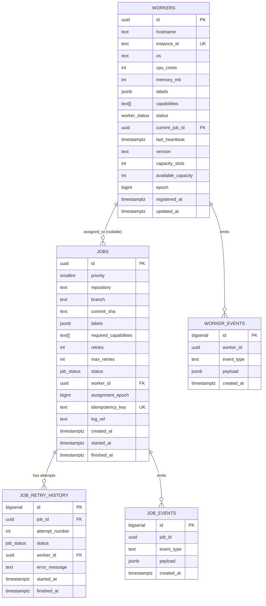

# 3. PostgreSQL Database Schema

## 3.1 ER diagram



## 3.2 DDL

```sql
-- =========================================================
-- Enums
-- =========================================================
CREATE TYPE worker_status AS ENUM (
    'REGISTERING', 'READY', 'BUSY', 'DRAINING', 'OFFLINE', 'DEAD'
);

CREATE TYPE job_status AS ENUM (
    'QUEUED', 'ASSIGNED', 'RUNNING', 'SUCCESS', 'FAILED', 'RETRYING', 'CANCELLED'
);

-- =========================================================
-- workers
-- =========================================================
CREATE TABLE workers (
    id                  UUID PRIMARY KEY DEFAULT gen_random_uuid(),
    hostname            TEXT NOT NULL,
    instance_id         TEXT NOT NULL,          -- stable across process restarts; drives idempotent re-registration
    os                  TEXT NOT NULL,
    cpu_cores           INTEGER NOT NULL CHECK (cpu_cores > 0),
    memory_mb           INTEGER NOT NULL CHECK (memory_mb > 0),
    labels              JSONB NOT NULL DEFAULT '{}',
    capabilities        TEXT[] NOT NULL DEFAULT '{}',
    status              worker_status NOT NULL DEFAULT 'REGISTERING',
    current_job_id      UUID,                    -- FK added after jobs table exists (circular dependency)
    last_heartbeat      TIMESTAMPTZ,
    version             TEXT NOT NULL,
    capacity_slots      INTEGER NOT NULL DEFAULT 1 CHECK (capacity_slots > 0),
    available_capacity  INTEGER NOT NULL DEFAULT 1 CHECK (available_capacity >= 0),
    epoch               BIGINT NOT NULL DEFAULT 1,  -- fencing token, incremented on every re-registration
    registered_at       TIMESTAMPTZ NOT NULL DEFAULT now(),
    updated_at          TIMESTAMPTZ NOT NULL DEFAULT now(),

    CONSTRAINT uq_workers_instance_id UNIQUE (instance_id)
);

-- Hot path: "find READY workers matching capability X" — the scheduler's most
-- frequent query. Partial index keeps it tiny even with 10k+ historical rows.
CREATE INDEX idx_workers_status_ready
    ON workers (status)
    WHERE status IN ('READY', 'BUSY');

-- Dead-worker reaper sweep: "find workers whose heartbeat is stale"
CREATE INDEX idx_workers_last_heartbeat
    ON workers (last_heartbeat)
    WHERE status NOT IN ('OFFLINE', 'DEAD');

-- Label/capability matching (GIN for containment queries: labels @> '{"region":"us-east-1"}')
CREATE INDEX idx_workers_labels_gin ON workers USING GIN (labels);
CREATE INDEX idx_workers_capabilities_gin ON workers USING GIN (capabilities);

CREATE TRIGGER trg_workers_updated_at
    BEFORE UPDATE ON workers
    FOR EACH ROW EXECUTE FUNCTION set_updated_at();

-- =========================================================
-- jobs  (RANGE partitioned by created_at — see 3.3 on why)
-- =========================================================
CREATE TABLE jobs (
    id                      UUID NOT NULL DEFAULT gen_random_uuid(),
    priority                SMALLINT NOT NULL DEFAULT 5 CHECK (priority BETWEEN 0 AND 9),
    repository              TEXT NOT NULL,
    branch                  TEXT NOT NULL,
    commit_sha              TEXT NOT NULL,
    labels                  JSONB NOT NULL DEFAULT '{}',
    required_capabilities   TEXT[] NOT NULL DEFAULT '{}',
    retries                 INTEGER NOT NULL DEFAULT 0,
    max_retries              INTEGER NOT NULL DEFAULT 3,
    status                   job_status NOT NULL DEFAULT 'QUEUED',
    worker_id               UUID REFERENCES workers(id) ON DELETE SET NULL,
    assignment_epoch        BIGINT,               -- copy of worker's epoch at assignment time; fencing
    idempotency_key         TEXT,
    log_ref                 TEXT,
    created_at              TIMESTAMPTZ NOT NULL DEFAULT now(),
    started_at              TIMESTAMPTZ,
    finished_at              TIMESTAMPTZ,

    PRIMARY KEY (id, created_at)   -- created_at must be in PK for partitioning
) PARTITION BY RANGE (created_at);

-- One partition per month; automate creation with pg_partman or a cron'd
-- migration job that creates next month's partition ~1 week ahead of time.
CREATE TABLE jobs_2026_07 PARTITION OF jobs
    FOR VALUES FROM ('2026-07-01') TO ('2026-08-01');
CREATE TABLE jobs_2026_08 PARTITION OF jobs
    FOR VALUES FROM ('2026-08-01') TO ('2026-09-01');
-- ... etc, or use pg_partman's automated maintenance.

-- Idempotency dedupe: unique only within a rolling window in practice, but
-- global uniqueness is the safe default; NULLs (no idempotency key supplied)
-- are allowed to repeat since NULL <> NULL in a unique index.
CREATE UNIQUE INDEX uq_jobs_idempotency_key ON jobs (idempotency_key)
    WHERE idempotency_key IS NOT NULL;

-- Scheduler's primary read: "next QUEUED jobs ordered by priority then age"
-- Partial + covers the exact WHERE/ORDER BY the scheduling loop uses.
CREATE INDEX idx_jobs_queued_priority ON jobs (priority, created_at)
    WHERE status = 'QUEUED';

-- "What is this worker currently running / did run" (reaper + admin UI)
CREATE INDEX idx_jobs_worker_id ON jobs (worker_id)
    WHERE status IN ('ASSIGNED', 'RUNNING');

-- Lookups by commit/repo for dashboards and dedupe checks
CREATE INDEX idx_jobs_repo_branch ON jobs (repository, branch, created_at DESC);
CREATE INDEX idx_jobs_commit_sha ON jobs (commit_sha);

-- Time-range scans across all history (dashboards, retention jobs) —
-- BRIN is far smaller than BTREE for an append-mostly, time-ordered table.
CREATE INDEX idx_jobs_created_at_brin ON jobs USING BRIN (created_at);

-- Now that jobs exists, add the FK from workers -> jobs:
ALTER TABLE workers
    ADD CONSTRAINT fk_workers_current_job
    FOREIGN KEY (current_job_id) REFERENCES jobs(id) ON DELETE SET NULL;

-- =========================================================
-- job_retry_history
-- =========================================================
CREATE TABLE job_retry_history (
    id              BIGSERIAL PRIMARY KEY,
    job_id          UUID NOT NULL,
    job_created_at  TIMESTAMPTZ NOT NULL,   -- needed to reference partitioned FK target
    attempt_number  INTEGER NOT NULL,
    status          job_status NOT NULL,
    worker_id       UUID REFERENCES workers(id) ON DELETE SET NULL,
    error_message   TEXT,
    started_at      TIMESTAMPTZ NOT NULL,
    finished_at     TIMESTAMPTZ,

    CONSTRAINT fk_retry_job FOREIGN KEY (job_id, job_created_at)
        REFERENCES jobs (id, created_at) ON DELETE CASCADE,
    CONSTRAINT uq_retry_attempt UNIQUE (job_id, attempt_number)
);

CREATE INDEX idx_retry_history_job_id ON job_retry_history (job_id);

-- =========================================================
-- worker_events / job_events — append-only audit log
-- (cheap insurance for debugging "why did this happen" post-incident)
-- =========================================================
CREATE TABLE worker_events (
    id          BIGSERIAL PRIMARY KEY,
    worker_id   UUID NOT NULL,
    event_type  TEXT NOT NULL,   -- e.g. REGISTERED, HEARTBEAT_LOST, MARKED_DEAD, DRAIN_STARTED, DRAIN_COMPLETE
    payload     JSONB NOT NULL DEFAULT '{}',
    created_at  TIMESTAMPTZ NOT NULL DEFAULT now()
);
CREATE INDEX idx_worker_events_worker_id_time ON worker_events (worker_id, created_at DESC);

CREATE TABLE job_events (
    id          BIGSERIAL PRIMARY KEY,
    job_id      UUID NOT NULL,
    event_type  TEXT NOT NULL,   -- e.g. QUEUED, ASSIGNED, STARTED, RETRIED, COMPLETED, CANCELLED
    payload     JSONB NOT NULL DEFAULT '{}',
    created_at  TIMESTAMPTZ NOT NULL DEFAULT now()
);
CREATE INDEX idx_job_events_job_id_time ON job_events (job_id, created_at DESC);

-- =========================================================
-- Helper trigger function
-- =========================================================
CREATE OR REPLACE FUNCTION set_updated_at() RETURNS TRIGGER AS $$
BEGIN
    NEW.updated_at = now();
    RETURN NEW;
END;
$$ LANGUAGE plpgsql;
```

## 3.3 Design notes / performance considerations

**Why `jobs` is partitioned by `created_at` and `workers` is not.** At "millions of jobs" scale, an unpartitioned `jobs` table means every index keeps growing forever and vacuum/autovacuum has to walk the whole table. Monthly range partitions mean: old partitions can be detached and archived to cold storage (or just dropped after a retention period) in O(1) instead of a `DELETE` that scans and generates enormous WAL; the active partition (current month) stays small, so the hot indexes (`idx_jobs_queued_priority` especially) stay in memory. `workers` tops out at ~10,000 live rows by requirement — no partitioning benefit, and partitioning would complicate the FK from `jobs.worker_id`.

**Why the scheduling query is a partial index, not a full one.** `idx_jobs_queued_priority` only indexes rows where `status = 'QUEUED'`. Once a job leaves QUEUED it's dead weight in that index. Given the ratio of terminal jobs to queued jobs at any instant is enormous (most jobs, most of the time, are SUCCESS/FAILED history), this keeps the scheduler's hottest query touching a tiny, cache-resident index instead of scanning entries for millions of finished jobs.

**Why `current_job_id` on `workers` duplicates information already in `jobs.worker_id`.** It's a deliberate denormalization for a single reason: the scheduler's assignment transaction needs to atomically flip both "this worker is now BUSY with job X" and "this job is now ASSIGNED to worker X" in one statement/transaction, and having the pointer on both rows lets that be a single `UPDATE ... FROM` (see doc 5) rather than requiring a join to discover a worker's current job on every heartbeat.

**Why `job_retry_history` is a separate table instead of a JSONB array on `jobs`.** Retry history needs its own indexed lookups ("show me all attempts for job X" for the dashboard), and appending to a normalized table is a plain `INSERT` (cheap, no row rewrite), whereas appending to a JSONB column means rewriting the whole (growing) column on every retry — worse write amplification exactly on the path (failed builds) where you can least afford it.

**Read replica.** `list jobs` / `list workers` / dashboard queries are pointed at a Postgres read replica via connection routing in the API layer, so dashboard traffic (bursty, human-driven) never contends with the scheduler's write-heavy hot path on the primary.

**What I'd revisit at 10k workers / true production scale:** heartbeat writes are *not* going straight to this schema on every 5s tick (2,000 writes/sec sustained is wasteful and this schema isn't optimized for that write pattern) — Redis absorbs that, and Postgres gets throttled/batched updates. See doc 4 for exactly how. If dashboard read load ever gets heavy enough that even the replica struggles, the next step is a materialized summary table (`worker_status_summary`, `job_queue_depth_by_priority`) refreshed every few seconds instead of querying `workers`/`jobs` directly for aggregate views.

---

**Next:** doc 4, the Redis data model — how the write-heavy heartbeat path avoids hammering this schema.
