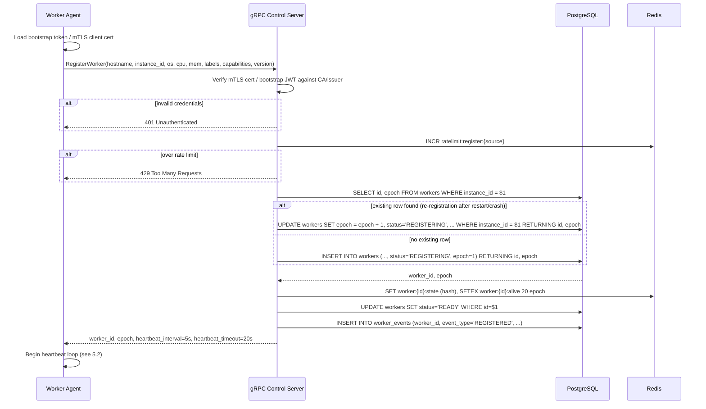
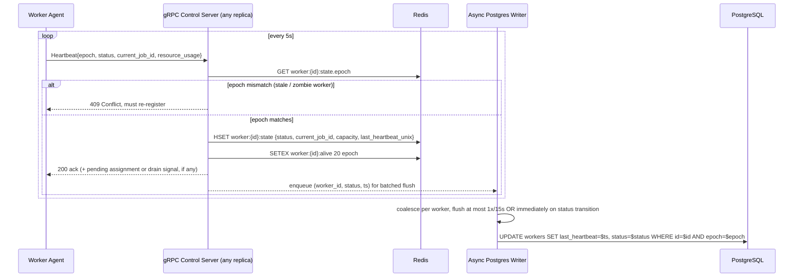
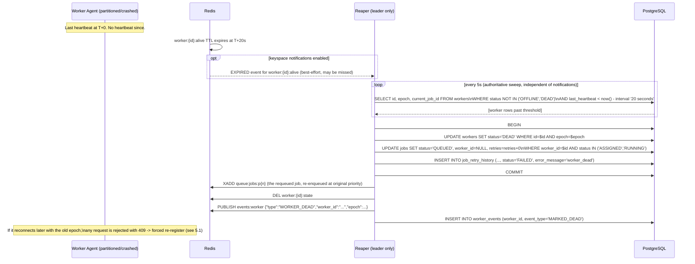

# 5. Sequence Diagrams

## 5.1 Worker registration



**Note on the re-registration branch.** A worker that crashes and restarts (or reconnects after a network partition long enough to be marked DEAD) re-registers with the *same* `instance_id`. The scheduler recognizes it, bumps `epoch`, and treats it as a fresh worker rather than creating a duplicate row, which is what keeps the `workers` table bounded at "current fleet size" instead of accumulating a new row per restart. The epoch bump is also the fencing mechanism that invalidates any job assignment made under the worker's *previous* epoch (see 5.3, zombie worker case).

## 5.2 Heartbeat flow



**Why status transitions bypass the 15s coalescing window.** If a worker heartbeats "I just went BUSY" or "I just went READY", the scheduler on a *different* replica reading Postgres (rather than Redis) for a slower-path decision must see that promptly, so any change relative to the last-flushed status forces an immediate write rather than waiting for the batch window.

## 5.3 Failure detection (dead worker)



**Edge cases this flow has to handle correctly:**

1. **Worker is alive but just partitioned from the scheduler (not actually crashed), and is still running a build.** It gets marked DEAD and its job requeued/reassigned to another worker. When the partition heals, the original worker tries to heartbeat with its old epoch and is rejected (409), forcing it to re-register. Critically, if it was still executing the (now reassigned) build, **it must abort that build on receiving the 409** rather than reporting a stale completion: this is a worker-agent responsibility specified explicitly in the agent's contract (doc 9 covers this as a design requirement). This is the split-brain scenario that makes the epoch/fencing mechanism non-optional rather than a nice-to-have.
2. **Clock skew between worker and scheduler.** The 20s threshold is evaluated using `last_heartbeat`, a server-assigned timestamp (`now()` at the moment the scheduler received the heartbeat), never a client-supplied timestamp. Worker clock drift can't influence the liveness decision.
3. **Reaper itself is on a leader that crashes mid-sweep.** The `UPDATE jobs ... UPDATE workers` sequence is inside a single transaction: either both commit or neither does, so a job can never end up "requeued but worker still shows BUSY" or vice versa. If the leader dies before COMMIT, the transaction rolls back entirely and the next-elected leader's sweep picks up the same stale worker on its next pass.
4. **Duplicate heartbeats arriving out of order (retried by a flaky worker-side network stack).** Heartbeats are idempotent by construction: the handler always does a last-write-wins `HSET`/`SETEX` and an `UPDATE ... WHERE epoch=$epoch`; processing the same heartbeat twice, or an older one arriving after a newer one due to reordering, has a defined and safe outcome. (Reordering-induced "stale overwrite" is a solved edge case; see doc 6.)

## 5.4 Job submission → scheduling → assignment → completion

```mermaid
sequenceDiagram
    participant Client
    participant API as REST API Server
    participant PG as PostgreSQL
    participant Redis as Redis
    participant Sched as Scheduler Core (leader)
    participant GRPC as gRPC Control Server
    participant Worker as Worker Agent

    Client->>API: POST /jobs {repository, branch, commit_sha, required_capabilities, priority, idempotency_key}
    API->>PG: SELECT id FROM jobs WHERE idempotency_key = $1
    alt duplicate idempotency_key
        PG-->>API: existing job row
        API-->>Client: 409 (existing job)
    else new job
        API->>PG: INSERT INTO jobs (..., status='QUEUED') RETURNING id
        API->>Redis: XADD queue:jobs:p{priority} {job_id, repository, branch, commit_sha, required_capabilities}
        API->>PG: INSERT INTO job_events (job_id, event_type='QUEUED')
        API-->>Client: 202 {job_id, status: QUEUED}
    end

    loop scheduler loop, continuous
        Sched->>Redis: XREADGROUP GROUP schedulers (queue:jobs:p0 .. p9, highest priority first)
        Redis-->>Sched: job entry (or empty)
        Sched->>Redis: SCAN candidate workers via worker:*:state (status=READY, capacity>0, capability match, label affinity)
        Sched->>Sched: Apply scheduling algorithm (capability match -> least-loaded among matches, see doc 9)
        alt candidate found
            Sched->>Redis: SET lock:job:{job_id}:assign NX PX 5000
            Sched->>PG: BEGIN
            Sched->>PG: UPDATE workers SET status='BUSY', current_job_id=$job_id, available_capacity=available_capacity-1\nWHERE id=$worker_id AND status='READY' AND epoch=$epoch
            Sched->>PG: UPDATE jobs SET status='ASSIGNED', worker_id=$worker_id, assignment_epoch=$epoch\nWHERE id=$job_id AND status='QUEUED'
            alt both updates affected exactly 1 row
                Sched->>PG: COMMIT
                Sched->>Redis: XACK queue:jobs:p{n} job_id
                Sched->>GRPC: push assignment to worker (piggybacked on next heartbeat ack, or gRPC server-stream message)
                GRPC->>Worker: JobAssignment{job_id, assignment_epoch, repo, branch, sha}
            else race lost (worker taken by concurrent assignment, or job cancelled meanwhile)
                Sched->>PG: ROLLBACK
                Sched->>Sched: return job to front of in-memory retry / re-XADD if truly unassignable this tick
            end
            Sched->>Redis: DEL lock:job:{job_id}:assign
        else no capable/available worker
            Sched->>Sched: leave entry pending in stream; autoscaler notified of unmet demand (doc 9)
        end
    end

    Worker->>Worker: ack assignment, start build
    Worker->>GRPC: Heartbeat{status=BUSY, current_job_id} (job now visibly RUNNING)
    GRPC->>PG: UPDATE jobs SET status='RUNNING', started_at=now() WHERE id=$job_id AND assignment_epoch=$epoch

    Worker->>Worker: build completes (success or failure)
    Worker->>GRPC: ReportJobResult{job_id, assignment_epoch, status, exit_code, log_ref}
    GRPC->>PG: SELECT assignment_epoch FROM jobs WHERE id=$job_id
    alt assignment_epoch mismatch (job was reassigned already, this is a late/duplicate report)
        GRPC-->>Worker: 409, result discarded
        GRPC->>PG: INSERT INTO job_events (event_type='DUPLICATE_RESULT_DISCARDED')
    else epoch matches
        GRPC->>PG: BEGIN
        GRPC->>PG: UPDATE jobs SET status=$final_status, finished_at=now(), log_ref=$log_ref WHERE id=$job_id
        GRPC->>PG: UPDATE workers SET status='READY', current_job_id=NULL, available_capacity=available_capacity+1 WHERE id=$worker_id
        alt status = FAILED and retries < max_retries
            GRPC->>PG: UPDATE jobs SET status='RETRYING', retries=retries+1 WHERE id=$job_id
            GRPC->>PG: INSERT INTO job_retry_history (...)
            GRPC->>Redis: XADD queue:jobs:p{priority} (re-enqueue, after backoff delay, see doc 9 retry policy)
        end
        GRPC->>PG: COMMIT
        GRPC-->>Worker: 200 ack
    end
```

**Why the worker/job update in scheduling assignment is guarded by `WHERE status='READY'`/`WHERE status='QUEUED'` rather than trusting the in-memory candidate list.** The Redis-cached candidate list can be milliseconds stale: another scheduling goroutine (or, during a leader handoff window, a very-recently-demoted former leader) could have assigned the same worker in the interim. The `WHERE` clause makes the actual state mutation a compare-and-swap: if zero rows are affected, we know we lost the race and can safely retry rather than double-booking a worker. This is the single most important correctness guarantee in the whole system and it lives in Postgres, not in Redis or in-memory locking, deliberately.

---

**Next:** doc 6, the full failure-scenario matrix: what happens when each of these components dies, in detail.
